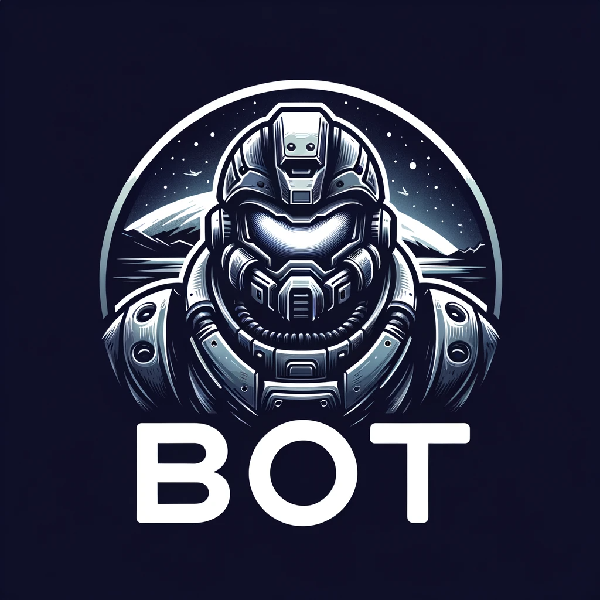

# STARTcraft

Comienza con el desarrollo de IA para Starcraft: BroodWar de la forma más rápida posible.

¿Eres nuevo en StarCraft o en la programación de IA? Mira el/los video(s) tutorial(es):
* Introducción a la IA en Starcraft: https://www.youtube.com/watch?v=czhNqUxmLks
* Tutorial de STARTcraft: https://www.youtube.com/watch?v=FEEkO6__GKw

Actualmente soportado (más opciones disponibles próximamente):
* Desarrollo en Windows / C++ usando BWAPI

# Instrucciones de Configuración:

## Windows / C++

STARTcraft viene con un StarterBot escrito en C++ utilizando BWAPI 4.4.0. Este repositorio incluye BWAPI y utiliza Injectory para lanzar StarCraft con BWAPI, por lo que no se requiere Chaoslauncher.

1. Descarga / Clona este repositorio en tu computadora.
2. Descarga y descomprime [Starcraft Broodwar 1.16.1](http://www.cs.mun.ca/~dchurchill/startcraft/scbw_bwapi440.zip) en la carpeta `starcraft` incluida.
3. Ejecuta `bin/RunC++BotAndStarcraft.bat`, lo que lanzará el ejecutable del bot y Starcraft / BWAPI.
4. Abre `visualstudio/StartCraft.sln` en Visual Studio 2022 para modificar / recompilar el código.

# Proyecto Bot de StarcraftBW Terran

